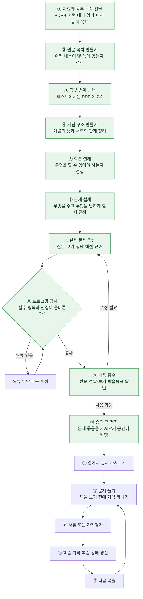

# Recaller 제품 흐름

마지막 확인: 2026-09-28 · 코드 기준: `46abc24a` 통합 브랜치 · 경로: **MCP**

Recaller는 자료를 읽고 끝내는 대신, 사용자가 직접 기억을 꺼내며 공부할 수 있는 문제로 바꾸는 도구다. 이 문서는 중학생도 이해할 수 있는 설명과 실제 연결 상태를 함께 유지한다.

## 현재 목표와 작업 범위

당장의 목표는 **MCP 기반의 자료 입력 → 문제 생성 → 저장 → 실제 학습·복습 흐름을 완결하고 검증하는 것**이다. 아래 도표는 제품이 지향하는 전체 흐름이고, 초록색과 상태표는 기하 변환 PDF 한 건에서 실제 확인된 범위다.

기획팀장은 작업 조율, 기획팀은 이 흐름 문서, 문제 출제 하네스 담당은 문제 제작 도구, 생성 품질 평가 담당은 결과물 검수를 맡는다. 문제 출제 하네스의 자유 배치 방식은 프로토타입 작업 중이며, 아래의 검증 완료 경로에 아직 포함하지 않는다. 운영팀은 현재 구성하지 않았다.

Firebase·별도 API 경로·VS Code 연동·학습자 기억·PDF 화면·중복 MCP 작업은 이번 완결 목표에서 잠시 보관한다. 기존 코드나 장기 가능성을 폐기한다는 결정은 아니다.

다만 이번 시험에서는 웹 학습 화면이 Firebase 설정 부재로 로그인 전에 막혔다. 따라서 **게시한 덱을 어디서 가져와 풀고 복습할지**는 아직 확인할 검증 경로가 남아 있다. Firebase 작업을 보관한 상태에서 웹 경로가 이미 완결됐다고 표시하지 않는다.

### 합의한 실행 순서

1. 문제 출제 하네스 프로토타입 결과를 확인한다.
2. 로그인 없이 쓰는 **로컬 개인앱 화면**에 MCP 발행 덱 가져오기·풀이·PC 저장을 연결한다. 공개 웹앱의 인증은 유지한다.
3. 앱 종료·재시작 후 자료·풀이 기록·복습 상태가 남는지 시험한다.
4. 검증된 흐름을 실행파일로 포장한다.
5. 여러 기기 간 동기화는 그다음에 다룬다.

2단계의 연결 경로는 코드에서 이미 일부 확인했다. MCP는 지정한 데이터 폴더의 `mcp/published`에 덱 파일을 발행하고, 앱에는 이를 읽어 브라우저 저장소에 가져온 뒤 학습 세션·풀이 기록·복습일을 저장하는 코드가 있다. 현재 로그인 화면과 덱 목록 API의 인증 때문에 실제 사용자 화면 시험까지 이어지지 못했다. 새 문제 출제 하네스의 자유 배치 문서는 기존 덱 카드와 데이터 형태가 달라, 프로토타입 확인 후 화면에 어떻게 보존할지 결정해야 한다.

## 전체 흐름

초록색은 2026-09-28 기하 변환 PDF 테스트에서 완료한 부분이다. 성공 표시는 모든 자료에서의 품질 보증이 아니다.

검사와 수정 화살표는 가능한 처리다. 이번 표본에서는 각 생성 단계가 첫 제출에 통과했다. 모든 노드가 별도 AI 호출이나 별도 화면을 의미하지는 않는다.

## 단계별 설명

### 1. 자료와 공부 목적

사용자는 PDF와 함께 “시험 대비”, “표현을 통째로 암기”, “계산을 연습”처럼 목적을 전달한다. 같은 회전 자료라도 행렬을 외우려는 경우와 회전한 좌표를 계산하려는 경우에 필요한 문제는 다르다.

현재 MCP에서는 AI가 자료를 읽고 판단한다. MCP 서버는 AI가 제출한 결과를 검사·변환·저장하는 도구다. 이 경로의 서버가 내부에서 별도로 AI API를 호출하는 것은 아니다.

### 2. 원문 목차

“무엇이 어디 있는가?”를 정리한다. 예: 평행이동 2쪽, 회전 3쪽, 확대축소 4쪽, 행렬·동차좌표 5~7쪽. 세부 항목과 페이지를 붙여 범위를 고르고 원문을 다시 찾을 수 있게 한다. 아직 중요도를 정해 내용을 버리거나 문제를 쓰는 단계가 아니다.

### 3. 공부 범위

전체 또는 특정 하위 목차를 선택한다. 이번에는 32쪽 중 2~7쪽을 골랐다. 현재 MCP는 별도 선택을 하지 않으면 전체 말단 목차를 사용하는 경로도 있다.

### 4. 개념 구조

“내용들이 어떻게 연결되는가?”를 정리한다. 평행이동은 좌표에 이동량을 더하고, 확대축소는 배율을 곱한다. 동차좌표를 쓰면 이 변환들을 같은 3×3 행렬 계산 방식으로 표현할 수 있다는 관계를 연결한다. 목차가 위치 지도라면 개념 구조는 내용의 관계 지도다.

### 5. 학습 설계

“공부한 뒤 무엇을 할 수 있어야 하는가?”를 정한다. 함께 익힐 내용을 묶고 따로 연습할 내용은 나눈다. ‘회전 행렬을 외운다’와 ‘회전한 좌표를 계산한다’는 다른 능력이다. 결과는 학습 목표와 필요한 지식 묶음이며 아직 완성된 문제는 아니다.

### 6. 문제 설계

목표를 확인할 방법을 정한다. 동차좌표를 변환하는 목표라면 ‘동차좌표를 주고, 평면 좌표쌍을 빈칸에 답하게 한다’로 설계한다. 주어지는 정보, 답해야 할 것, 문제 형식, 판정 기준을 정한다.

현재 지원 형식은 플래시카드·빈칸·OX·객관식·순서복원·구조복원이다. 앱이 지원하지 않는 활동을 구분하며, 일부 경우 핵심 내용을 묻는 플래시카드로 보완한다. 이 대체가 원래 목표를 충분히 평가하는지는 별도 검수한다.

### 7. 실제 문제 작성

설계에 실제 숫자와 문장을 넣고 보기·정답·해설·근거를 쓴다. 이번 예: “동차좌표 (6,8,2)가 나타내는 평면 좌표는 ____이다.” 정답은 (3,4), 이유는 각 좌표를 2로 나누기 때문이며 근거는 PDF 6쪽이다.

| 구분 | 회전 예시 |
| --- | --- |
| 학습 설계 | 회전한 점의 좌표를 계산할 수 있게 하자 |
| 문제 설계 | 점과 회전각을 주고 결과 좌표를 객관식으로 고르게 하자 |
| 문제 작성 | 점 (2,1)을 양의 90도 회전하면? 보기와 정답 (-1,2), 해설 작성 |

### 8~9. 프로그램 검사와 내용 검수

프로그램은 필수 항목, 문제·설계 연결, 선택지·정답 연결, 기록된 근거의 일치 등을 검사한다. 틀린 제출은 거부하고 필요한 부분을 다시 제출할 수 있다. 이것만으로 원문 해석과 학습 품질이 보장되지는 않는다. 원문 정확성, 여러 정답 가능성, 쉽게 찍히는 보기, 목표와의 일치는 별도로 읽고 검수한다.

### 10~11. 저장과 앱으로 가져오기

검토·승인된 문제를 덱(공부할 문제 묶음)으로 로컬 가져오기 공간에 발행한다. MCP가 저장했다는 사실과 앱에서 가져와 실제로 풀었다는 사실은 다르다. PDF 바이너리가 MCP 결과에 자동으로 포함되는 것도 아니다.

### 12~15. 풀이와 복습

문제를 보고 먼저 기억을 꺼낸 뒤 답과 해설을 확인한다. 지원되는 문제는 자동채점하고, 머릿속으로 답하는 플래시카드는 자기평가한다. 학습 기록과 복습 상태를 갱신해 이후 다시 공부한다. 설명을 읽거나 카드를 만들었다는 것만으로 사용자가 숙달했다고 판단하지 않는다.

## 현재 구현과 실제 검증의 경계

| 구간 | 2026-09-28 확인 상태 |
| --- | --- |
| MCP 생성 5단계 | 모두 첫 제출 성공, 객관식 4·빈칸 2 생성 |
| 로컬 덱 발행 | 성공 |
| 소요 시간 | 약 4분 42초. AI 작성·도구 왕복 포함 벽시계 시간이며 순수 추론 시간 아님 |
| 답안 채점 | 함수 검사에서 좌표 공백 및 ASCII/Unicode 마이너스 차이를 오답 처리하는 결함 발견 |
| 실제 웹 화면의 풀이·기록·복습 | 이번 표본 미검증. Firebase 설정 부재로 로그인 진입 차단 |
| 자유로운 배치의 새 문제작성 틀 | 별도 authoring 실험. 이 제품 흐름에 전체 연결되지 않음 |

현재 우선순위는 하네스 프로토타입 확인, 로컬 개인앱 연결, 채점 결함 수정·재시험 순이다. 문제 출제 하네스가 통합되어 실제 풀이까지 검증되면 이 흐름과 상태표에 반영한다.

이번에는 AI가 로컬 PDF를 읽고 자연어 단계 결과를 MCP에 제출했다. PDF 자체를 MCP 서버에 바이너리로 첨부한 테스트가 아니다. 실제 자료는 32쪽이며 PDF 페이지와 인쇄된 페이지 번호를 혼동하지 않는다.

예전에 논의한 `Analyze → Plan → Learning Design → Authoring`은 책임을 설명하던 구성이었다. 현재 MCP 실제 생성 단계는 `analyze(원문 목차) → concept-tree → learning-design → activity-design → cards`다. 웹/API 경로와 동일하다고 가정하지 않는다.

## 확인 근거와 갱신 규칙

- 경로 설명: [MCP 생성 문서](../PERSONAL_MCP_GENERATION.md)
- 실제 단계·저장: [MCP 구현](../../tools/study-forge-mcp/chatgpt-parity.ts), [도구 등록](../../tools/study-forge-mcp/server.ts)
- 코드 통합·검증 범위: [통합 보고서](../handoff/INTEGRATION_REPORT.md)
- 이번 로컬 시험 기록: `eval/local/product-flow-20260928-geometric/report.md` (GitHub 미포함)

흐름을 바꾸는 작업이 끝나면 이 문서의 설명·도표·상태표를 함께 고친다. 주 1회 변경 여부도 확인한다. 변화가 없으면 불필요하게 내용을 다시 쓰거나 알리지 않는다. 최신 코드와 실제 시험을 구분하고 미검증을 성공으로 바꾸지 않는다. 새 확인 날짜·코드 기준·핵심 변경은 아래에 짧게 남긴다. GitHub에서 관리하며 교수님 공유용 Notion에는 자동 복사하지 않는다.

### 변경 기록

- 2026-09-28: MCP 현재 흐름과 기하 변환 PDF 시험 결과를 기준으로 최초 작성. 생성·발행 성공, 채점 결함과 웹 학습 미검증을 구분.
- 2026-09-28: 당장의 MCP 흐름 완결 목표와 담당 구성, 보관 중인 주변 작업을 추가. 새 문제 출제 하네스는 미통합 상태로 유지.
- 2026-09-28: 기획팀장 명칭과 승인된 실행 순서 추가. 기존 덱의 로컬 연결 코드와 새 하네스 문서의 형태 차이를 확인했으나 실제 학습 완료로 표기하지 않음.
