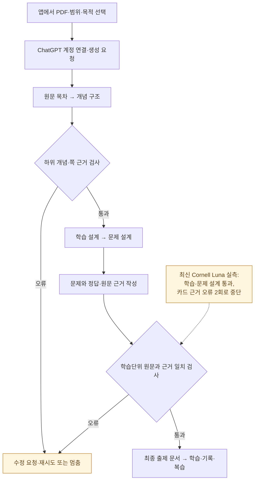
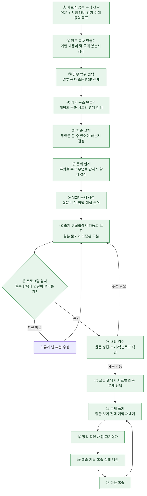

# Recaller 제품 흐름

마지막 확인: 2026-10-05 · 문서 기준 브랜치: `codex/recaller-integration`(`241f7caa`) · 후속 구현·검증: `claude/local-state-20260928`(`cba5e349`, 별도 브랜치)

Recaller는 자료를 읽고 끝내는 대신, 사용자가 직접 기억을 꺼내며 공부할 수 있는 문제로 바꾸는 도구다. 이 문서는 중학생도 이해할 수 있는 설명과 실제 연결 상태를 함께 유지한다.

2026-09-28의 MCP 학습 검증과 2026-10-02의 앱 안 자동 생성 검증을 구분한다. 후속 자동 생성 코드는 별도 협업 브랜치에 있으며 이 문서의 기준 브랜치에는 아직 포함되지 않았다. 원문 PDF·개인 학습 데이터·상세 실험 로그도 Git clone만으로 이전되지 않는다.

## 최신 변화: 앱 안에서 생성하기

기존에는 대화 중인 AI가 MCP 도구로 단계 결과를 제출했다. 후속 협업 브랜치에서는 `/study`에서 자료·범위·목적을 정하고 요청하면, 앱의 자동 실행기가 연결된 ChatGPT 계정으로 같은 생성 단계를 진행한다. `/lab`에서는 단계 결과·시간·모델·재시도를 확인한다. MCP 경로를 없앤 것이 아니며, 기준 브랜치에 이 구현이 합쳐졌다는 뜻도 아니다.

이 도표는 후속 브랜치의 구현 흐름이다. 마지막 실측에서 최종 출제·학습까지 도달한 것은 아니다. 프로그램 검사를 통과했다는 사실과 학습 품질이 좋다는 판단도 구분한다.

| 후속 항목 | 구현·실제 확인 상태 |
| --- | --- |
| 앱 안 자동 실행·계정 연결 | 협업 브랜치에 구현. 사용자 로그인 후 실제 모델 응답 확인. 로그인 토큰·키는 저장소에 넣지 않음 |
| 개념 구조 입력·제출 검사 | 개념 구조에도 선택 쪽 원문 전달. 하위 개념 없는 구조는 제출 단계에서 거부. 이전 실제 Sol 답 오프라인 재생으로 거부 확인 |
| 최신 Cornell 1~2쪽 Luna·low | 원문 목차·개념 구조·학습 설계·문제 설계 통과. 목표 3개. 카드 2번의 학습단위 원문 근거 검사에서 같은 오류 2회로 중단. 73.461초, 새 HTTP 요청 7회·추가 전송 전 차단 1회 |
| Cornell Sol·medium 재실측 | 최신 수정 후에는 미실행. Luna 반복 실패로 먼저 중단. 이전 Sol 실측의 실패를 수정 후 성공으로 쓰지 않음 |
| 나머지 PDF·노트 실측 | Cornell 두 조합의 최종 통과 조건 미충족으로 미실행. 가짜 모델 화면 검증과 실제 답 품질 검증을 구분 |
| 코드·화면 검사 | 담당 검증 기록상 현행 필수 86/86, 호출 보호 모의 검사 3/3, 린트 오류 0·빌드 성공. 옛 API 모의 테스트 별도 실패는 미해결. 이번 문서 점검에서는 시험을 재실행하지 않음 |

최근 승인된 호출 원장은 누적 20/60회(초기 연결 실패 2회도 보수 차감), 잔여 40회로 중단 상태다. 이는 2026-10-02 기록 기준이지 오늘 새로 호출했다는 뜻이 아니다. 다음 문제는 **카드의 근거와 해당 학습단위 원문이 왜 일치하지 않는지**이며, 자동 생성 전체 성공이나 모델 우열은 아직 결론내리지 않는다.

코드 근거(별도 브랜치): [자동 실행기](https://github.com/starvvolf/EasyMemory/blob/cba5e349/src/lib/study/auto-executor.ts), [제출 검사](https://github.com/starvvolf/EasyMemory/blob/cba5e349/tools/study-forge-mcp/chatgpt-parity.ts), [검증기록 11·Claude 검토](https://github.com/starvvolf/EasyMemory/blob/cba5e349/협업/검증기록_11.md). 원문 없는 실측 요약도 해당 브랜치에 보존하며, 원문 포함 상세 로그는 로컬에만 둔다. `docs/handoff/START_HERE.md`는 2026-09-22 인수인계이므로 최신 자동 생성 상태의 증명으로 사용하지 않는다.

## 기존 MCP 경로: 2026-09-28 목표와 검증 범위

**사용자가 대화에서 자료·범위·목적을 지시 → 담당 AI가 MCP로 문제 생성 → 로컬 앱에서 풀이·기록·복습**하는 경로를 확인했다. 기하 2~7쪽과 반도체 16~20쪽의 대표 범위를 넘어, 최신 전체 범위 출제본도 기하 28문항·반도체 22문항으로 저장하고 앱의 자료별 목록에 연결했다. 다만 50문항 전부를 사람이 풀거나 학습 품질을 검수한 것은 아니다.

기획팀장은 작업 조율, 기획팀은 이 흐름 문서, 문제 출제 하네스 담당은 문제 제작 도구, 생성 품질 평가 담당은 결과물 검수를 맡는다. MCP 5단계의 원본 문제와 별도 출제 편집틀에서 다듬은 최종 문제는 서로 다른 결과로 보존한다. 운영팀은 현재 구성하지 않았다.

Firebase 클라우드 서비스·별도 API 생성 경로·VS Code 연동·고급 학습자 기억·독립 PDF 읽기 기능은 이번 대표 범위 검증에서 잠시 보관한다. 기존 코드나 장기 가능성을 폐기한다는 결정은 아니다. 원문 PDF 페이지 열람은 현재 로컬 학습 화면에서 사용한다.

처음에는 Firebase 설정이 없어 로그인 화면에서 막혔다. 현재는 기본 인증을 유지한 채, 같은 PC의 `127.0.0.1`에서만 켜는 **로컬 실험 모드**로 문제 보기·풀이·기록을 연결했다. 다른 기기 동기화나 클라우드 서비스는 확인하지 않았다.

### 합의한 실행 순서

1. 완료: 출제 편집틀에서 원본 문제를 다듬고 최종 문서를 별도로 보존했다.
2. 완료: 로컬 개인앱이 검증된 출제 문서를 발견해 자료별 문제 목록·원문·복습 후보를 보여준다. 공개 웹앱의 기본 인증은 유지한다.
3. 완료: 같은 PC·브라우저·주소에서 대표 범위의 새로고침과 서버 재시작 뒤 자료·풀이 위치·기록을 복원했다. 최신 전체 범위는 새로고침과 자료 전환 뒤 기록 분리를 확인했다.
4. 일부 완료: 개발 명령 없이 여는 시작용 `.cmd`를 검증했다. 별도 설치형 실행파일로 포장한 것은 아니다.
5. 보류: 여러 기기 간 동기화.

현재 확인한 학습 경로는 출제 편집틀의 검증된 문서를 로컬 화면이 자동 발견하는 방식이다. 원본 MCP Cards와 편집 결과, 문항별 풀이 사건을 각각 보존한다. 같은 브라우저의 로컬 저장소에 이어하기 위치와 복습 후보가 남는다. 기존 덱 발행·가져오기 코드도 있지만, 이를 이번 최종 출제 문서의 실제 학습 경로와 동일하다고 주장하지 않는다.

## 전체 흐름

초록색은 2026-09-28 두 PDF의 **대표 범위에서 끝까지 확인한 경로**다. 전체 범위 28·22문항은 앱 연결과 일부 풀이·기록까지 확인했으며, 모든 문항의 품질이나 완료를 뜻하지 않는다.

검사와 수정 화살표는 가능한 처리다. 선택 범위의 실제 MCP 단계는 첫 제출에 통과했고 최종 출제본은 별도 편집에서 다듬었다. 모든 노드가 별도 AI 호출이나 별도 화면을 의미하지는 않는다. 생성 지시는 대화에서 담당 AI에게 주며, 웹 버튼만으로 무인 AI 생성이 시작되지는 않는다.

## 단계별 설명

### 1. 자료와 공부 목적

사용자는 PDF와 함께 “시험 대비”, “표현을 통째로 암기”, “계산을 연습”처럼 목적을 전달한다. 같은 회전 자료라도 행렬을 외우려는 경우와 회전한 좌표를 계산하려는 경우에 필요한 문제는 다르다.

현재 MCP에서는 AI가 자료를 읽고 판단한다. MCP 서버는 AI가 제출한 결과를 검사·변환·저장하는 도구다. 이 경로의 서버가 내부에서 별도로 AI API를 호출하는 것은 아니다.

### 2. 원문 목차

“무엇이 어디 있는가?”를 정리한다. 예: 평행이동 2쪽, 회전 3쪽, 확대축소 4쪽, 행렬·동차좌표 5~7쪽. 세부 항목과 페이지를 붙여 범위를 고르고 원문을 다시 찾을 수 있게 한다. 아직 중요도를 정해 내용을 버리거나 문제를 쓰는 단계가 아니다.

### 3. 공부 범위

전체 또는 특정 하위 목차를 선택한다. 대표 범위 검증에서는 기하 32쪽 중 2~7쪽을 골랐고, 후속 전체 범위 출제에서는 기하 32쪽·반도체 44쪽을 대상으로 삼았다. 현재 MCP는 별도 선택을 하지 않으면 전체 말단 목차를 사용하는 경로도 있다.

### 4. 개념 구조

“내용들이 어떻게 연결되는가?”를 정리한다. 평행이동은 좌표에 이동량을 더하고, 확대축소는 배율을 곱한다. 동차좌표를 쓰면 이 변환들을 같은 3×3 행렬 계산 방식으로 표현할 수 있다는 관계를 연결한다. 목차가 위치 지도라면 개념 구조는 내용의 관계 지도다.

### 5. 학습 설계

“공부한 뒤 무엇을 할 수 있어야 하는가?”를 정한다. 함께 익힐 내용을 묶고 따로 연습할 내용은 나눈다. ‘회전 행렬을 외운다’와 ‘회전한 좌표를 계산한다’는 다른 능력이다. 결과는 학습 목표와 필요한 지식 묶음이며 아직 완성된 문제는 아니다.

### 6. 문제 설계

목표를 확인할 방법을 정한다. 동차좌표를 변환하는 목표라면 ‘동차좌표를 주고, 평면 좌표쌍을 빈칸에 답하게 한다’로 설계한다. 주어지는 정보, 답해야 할 것, 문제 형식, 판정 기준을 정한다.

현재 지원 형식은 플래시카드·빈칸·OX·객관식·순서복원·구조복원이다. 앱이 지원하지 않는 활동을 구분하며, 일부 경우 핵심 내용을 묻는 플래시카드로 보완한다. 이 대체가 원래 목표를 충분히 평가하는지는 별도 검수한다.

### 7. 실제 문제 작성

설계에 실제 숫자와 문장을 넣고 보기·정답·해설·근거를 쓴다. 이번 예: “동차좌표 (6,8,2)가 나타내는 평면 좌표는 ____이다.” 정답은 (3,4), 이유는 각 좌표를 2로 나누기 때문이며 근거는 PDF 6쪽이다.

| 구분 | 회전 예시 |
| --- | --- |
| 학습 설계 | 회전한 점의 좌표를 계산할 수 있게 하자 |
| 문제 설계 | 점과 회전각을 주고 결과 좌표를 객관식으로 고르게 하자 |
| 문제 작성 | 점 (2,1)을 양의 90도 회전하면? 보기와 정답 (-1,2), 해설 작성 |

### 8~10. 출제 편집·프로그램 검사·내용 검수

원본 Cards를 출제 편집틀에서 다듬고 최종 문서로 따로 보존한다. 프로그램은 필수 항목, 문제·설계 연결, 선택지·정답 연결, 기록된 근거의 일치 등을 검사한다. 틀린 제출은 거부하고 필요한 부분을 다시 제출할 수 있다. 이것만으로 원문 해석과 학습 품질이 보장되지는 않는다. 원문 정확성, 여러 정답 가능성, 쉽게 찍히는 보기, 목표와의 일치는 별도로 읽고 검수한다.

### 11. 최종 출제본과 앱 연결

로컬 앱은 원천 실행과 문서 버전이 맞는 검증된 최종 문서를 발견해 보여준다. 자료명·쪽 범위·날짜로 학습자료와 문제 묶음을 구분하고, 선택한 자료에 연결된 문제만 목록에 낸다. 저장됐다는 사실과 실제로 풀었다는 사실은 다르다. PDF 원본은 별도 자료 경로에서 열며, 문제 결과에 PDF 바이너리가 자동으로 포함되지는 않는다.

### 12~15. 풀이와 복습

문제를 보고 먼저 기억을 꺼낸 뒤 답과 해설을 확인한다. 풀이 전용 화면에서 현재 문항을 제출하거나 정답을 공개한 뒤 자기평가할 수 있다. 지원되는 문제는 자동채점하고, 직접 회상·단답 중 자동 판정이 어려운 답은 자기평가 또는 판정 보류로 남긴다. 답을 먼저 공개한 뒤의 응답은 독립 성공으로 세지 않는다. 문항별 기록이 학습목표 상태와 복습 후보에 반영되며, 설명을 읽거나 카드를 만들었다는 것만으로 숙달했다고 판단하지 않는다.

## 현재 구현과 실제 검증의 경계

| 구간 | 2026-09-28 확인 상태 |
| --- | --- |
| MCP 생성 5단계 | 기하 2~7쪽 8개 말단→원본 Cards 8문항, 반도체 16~20쪽 5개→5문항. 신규 반도체 16~18쪽 3개→3문항도 실제 실행 |
| 최종 출제 문서 | 별도 출제 편집틀에서 기하 9문항(동차좌표 말단만 2개), 반도체 5문항, 신규 반도체 3문항 보존. 원본 Cards와 구분 |
| 단계 재사용 | Analyze·개념트리·학습 설계 결과 3개 재사용 후 문제 설계·출제 2단계 신규 실행을 한 범위에서 확인 |
| 답안 채점 | 대표 문항의 실제 제출·정답 공개·자기평가를 확인. 단답 일부는 자동 정답 판정이 아닌 직접 확인. 기존 형식/세션 검사 56개와 출제 렌더러 검사 18개 통과 |
| 실제 로컬 화면의 풀이·기록·복습 | 기하 9문항과 반도체 5문항에서 풀이 위치·기록·복습 후보가 같은 주소의 새로고침/서버 재시작 뒤 복원됨. 신규 반도체 3문항도 풀이·원문·새로고침 확인 |
| 최신 전체 범위의 앱 연결 | 기하 28문항·28개 목표, 반도체 22문항·22개 목표를 정식 출제 문서로 저장하고 자료별 목록에서 확인. 기하의 실제 제출 2건·자기평가 1건이 목표·복습에 반영되고 새로고침 뒤 2/28 진행 상태가 복원됨. 반도체 전환 시 기하 기록이 섞이지 않음. 정답 공개 뒤 제출은 독립 정답으로 계산하지 않음. 전 문항 풀이·품질 검수는 미완료 |
| 문제 풀이 화면 | 긴 답 여러 줄 입력, 수식 정답 표시, 객관식 마우스 선택을 실제 화면에서 확인. 이중 스크롤과 자기평가 위치는 풀이 전용 화면으로 조정. 기존의 마우스 입력 불가 현상은 재현되지 않아 원인 확인으로 쓰지 않음 |
| 실행 환경 | 로컬 시작용 `.cmd`의 서버 없는 상태 기동과 브라우저 열림 확인. 클라우드·다른 기기·설치형 실행파일은 미검증 |

대표 범위의 로컬 흐름과 최신 50문항의 앱 연결·일부 실제 풀이를 확인했다. 다음 검증 대상은 최신 50문항 전체의 출제 품질과 여러 문항을 이어 푸는 사용성이다. 학습설계 목록 응답은 확인 중 약 4~20초로 변동했다. 기하 7쪽 원천 목차 ID 연결이 과도한 결함도 남아 있어, 그 연결만으로 목차별 숙련도를 자동 계산하지 않는다.

이번에는 AI가 로컬 PDF를 읽고 자연어 단계 결과를 MCP에 제출했다. PDF 자체를 MCP 서버에 바이너리로 첨부한 테스트가 아니다. 실제 자료는 기하 32쪽·반도체 44쪽이며 PDF 페이지와 인쇄된 페이지 번호를 혼동하지 않는다.

예전에 논의한 `Analyze → Plan → Learning Design → Authoring`은 책임을 설명하던 구성이었다. 현재 MCP 실제 생성 단계는 `analyze(원문 목차) → concept-tree → learning-design → activity-design → cards`다. 웹/API 경로와 동일하다고 가정하지 않는다.

## 확인 근거와 갱신 규칙

- 경로 설명: [MCP 생성 문서](../PERSONAL_MCP_GENERATION.md)
- 실제 단계·저장: [MCP 구현](../../tools/study-forge-mcp/chatgpt-parity.ts), [도구 등록](../../tools/study-forge-mcp/server.ts)
- 초기 코드 통합·검증 범위: [통합 보고서](../handoff/INTEGRATION_REPORT.md)
- 실제 두 PDF MCP 실행·문항 연결: `eval/local/mcp-exec-20260928-sol-medium-r01/EXECUTION_REPORT.md` (로컬 실험 파일, GitHub 미포함)
- 학습·재시작 확인: `docs/experiments/personalization/V1_WEB_INTEGRATION.md` (현재 미추적 로컬 문서)
- 현재 앱 연결 코드: [실행 보기](../../src/app/mcp-runs/page.tsx), [출제 문서 발견](../../src/lib/personalization-lab/artifacts.ts), [학습 기록](../../src/lib/personalization-lab/storage.ts)
- 전체 범위 후속 확인: `tools/problem-authoring-lab/runs/integrated-{geometry,semiconductor}-full-20260928-r02/iteration-0/document.json`(현재 로컬 미추적 파일), [자료별 학습 화면](../../src/app/mcp-personalization/PersonalizationLab.tsx), [목표와 문항 연결](../../src/lib/personalization-lab/cycles.ts), [문제 화면](../../tools/problem-authoring-lab/renderer.ts). 실제 로컬 화면에서 자료 전환·풀이·자기평가·새로고침을 확인했고, 개인화 검사 21개·학습 검사 56개·문제 화면 검사 21개와 관련 TypeScript/린트 검사가 통과했다. 이 변경과 테스트 파일 일부는 아직 원격에 없다.

흐름을 바꾸는 작업이 끝나면 이 문서의 설명·도표·상태표를 함께 고친다. 주 1회 변경 여부도 확인한다. 변화가 없으면 불필요하게 내용을 다시 쓰거나 알리지 않는다. 최신 코드와 실제 시험을 구분하고 미검증을 성공으로 바꾸지 않는다. 새 확인 날짜·코드 기준·핵심 변경은 아래에 짧게 남긴다. GitHub에서 관리하며 교수님 공유용 Notion에는 자동 복사하지 않는다.

### 변경 기록

- 2026-10-05: 원격 기준 브랜치 `241f7caa`와 협업 브랜치 `cba5e349`를 구분해 갱신. 앱 안 ChatGPT 계정 자동 생성 흐름·제출 거부 검사·최신 Cornell 카드 근거 실패를 설명/도표/검증표에 함께 반영. 기존 MCP 학습 검증을 최신 자동 생성 성공으로 확대하지 않음. 제품 코드·모델 호출·시험 실행·브랜치 병합 없이 문서만 수정.

- 2026-09-28: MCP 현재 흐름과 기하 변환 PDF 시험 결과를 기준으로 최초 작성. 생성·발행 성공, 채점 결함과 웹 학습 미검증을 구분.
- 2026-09-28: 당장의 MCP 흐름 완결 목표와 담당 구성, 보관 중인 주변 작업을 추가. 새 문제 출제 하네스는 미통합 상태로 유지.
- 2026-09-28: 기획팀장 명칭과 승인된 실행 순서 추가. 기존 덱의 로컬 연결 코드와 새 하네스 문서의 형태 차이를 확인했으나 실제 학습 완료로 표기하지 않음.
- 2026-09-28: 기하·반도체의 선택 범위에서 실제 MCP 5단계→별도 최종 출제본→로컬 풀이·기록·복습·재시작 확인을 반영. Firebase 차단은 loopback 로컬 모드로 해소했으며, 전체 PDF·최신 50문항·다른 기기는 미검증으로 유지. 근거는 위 실행·개인화 기록과 현재 코드.
- 2026-09-28: 전체 범위 기하 28문항·반도체 22문항을 정식 기록해 자료별 앱 목록에 연결. 기하 일부 문항의 풀이→자기평가→목표·복습 반영→새로고침, 반도체 전환 시 기록 분리, 정답 공개 후 비독립 처리와 풀이 화면 수정을 반영. 전체 문항 품질·풀이 완료는 미검증으로 남김. 코드 기준 `86c5cc00` + 위 로컬 미커밋 변경.
