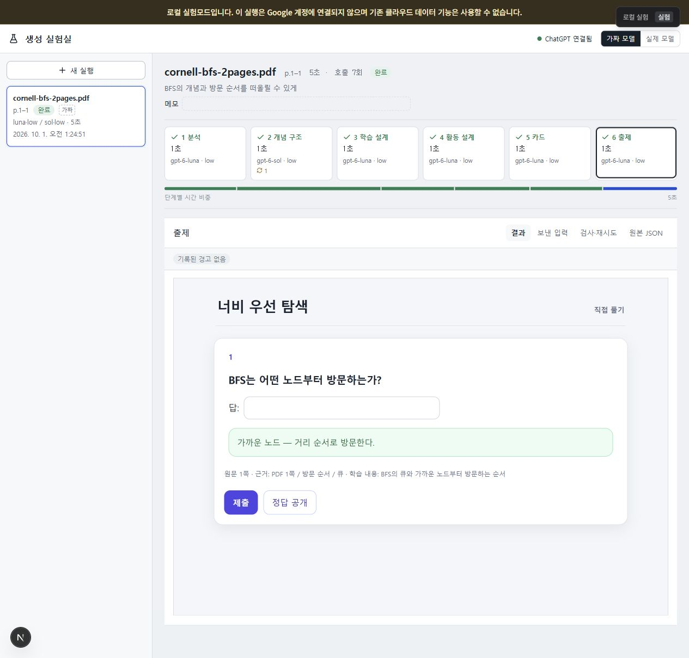
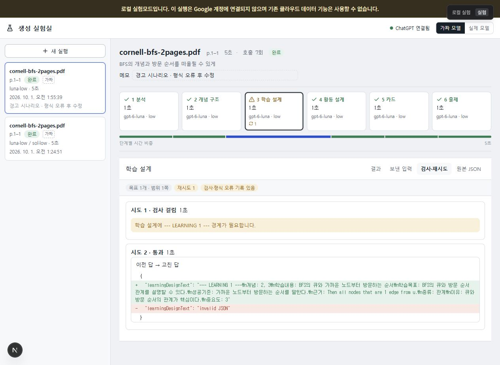
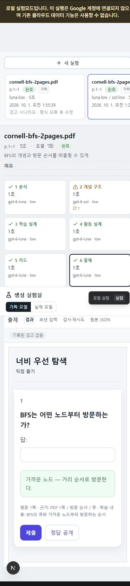
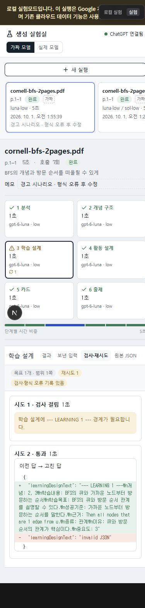
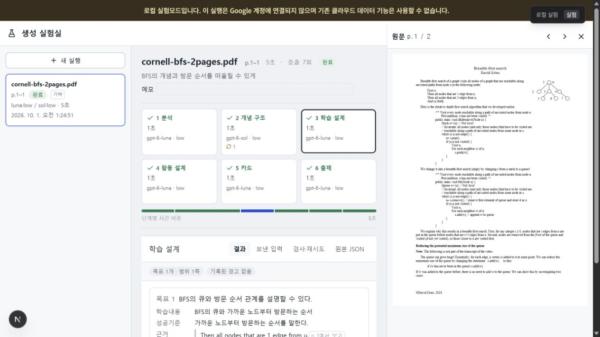
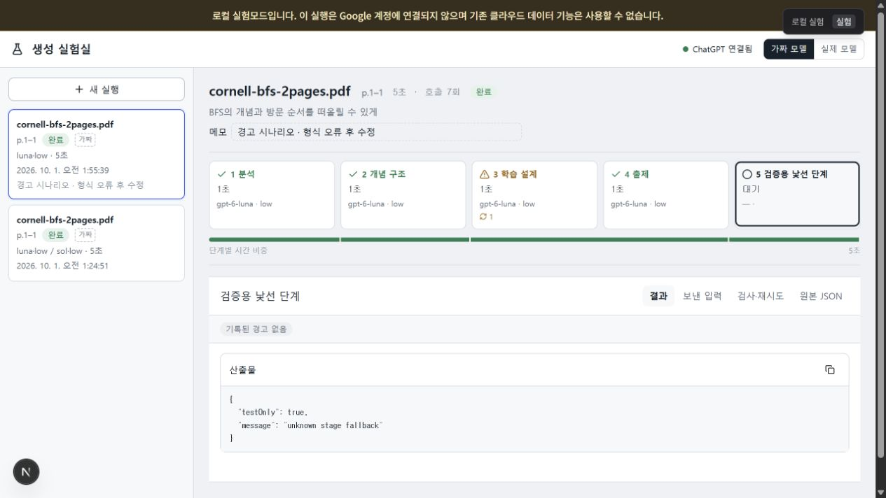
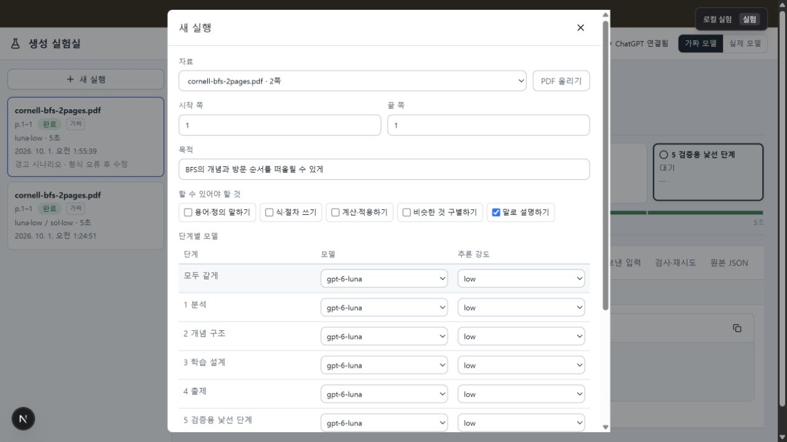
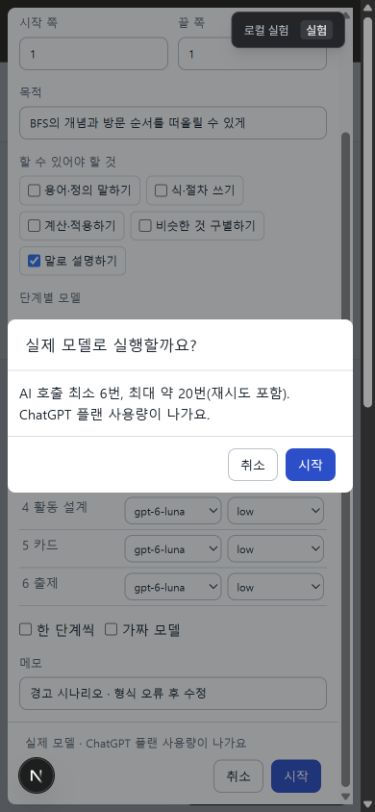

# 작업지시 08 결과보고: 생성 실험실

- 작업 브랜치: `claude/local-state-20260928`
- 기준 커밋: `0875fa2` (원격 최신 작업을 fast-forward로 반영한 뒤 구현)
- 화면: http://127.0.0.1:3000/lab
- 기준 문서: `작업지시_08_생성실험실.md`, `실험실/화면시안.html`
- 실제 AI 호출: **0회**. 확인창은 표시 후 취소했고, 개발 검증은 가짜 공급자로만 했다.
- 커밋/푸시: 구현 검증 후 사용자 요청에 따라 같은 작업 브랜치로 반영.

## 구현

- `/lab`: 실행 목록, 목적/메모, 단계별 상태·시간·모델·추론 강도·재시도, 시간 비중 막대.
- 서버의 단계 목록으로 격자, 새 실행 모델 표, 시간 막대를 구성. 알 수 없는 단계는 접힌 원본 JSON으로 대체.
- 결과 / 보낸 입력 / 검사·재시도 / 원본 JSON 탭. 호출 전문은 선택한 시도별로 열며 자동 갱신 중에도 선택을 유지.
- 분석 목차와 개념 나무, 목표/성공기준/인용/원문 검사, 활동 설계 표, 카드, 기존 출제 렌더러의 풀기·정답 공개.
- 등록 PDF 선택/업로드, 쪽 범위, 목적, 다섯 능력 선택, 단계별 모델 표와 모두 같게, 메모, 한 단계씩 옵션.
- PDF 근거를 클릭하면 해당 페이지 표시. 데스크톱은 오른쪽 패널, 모바일은 전체 화면.
- 기존 생성 요청과 자동 실행기를 재사용. 엔진의 5단계 계약과 출제 패킷은 변경하지 않음.
- 실행기 상태의 `lab` 설정, `paused-step`, 설정 변경 후 이어가기, 호출별 JSON 기록.
- 단계별 모델 우선순위: 실험실 설정 → 실행 옵션/환경변수 → 해당 단계의 요청 설정 → 기본값. 일반 학습 실행도 단계별 요청 모델을 사용.
- 원문 길이 제한은 유지하고 일부/전체 잘린 쪽을 호출 기록과 모델 입력에 명시.
- 호출 전문 기록은 실험실 실행에만 추가. 인증 토큰/쿠키는 제거하고 claim token은 API로 노출하지 않음.
- `/api/lab` 경로는 로컬 실험 모드·기존 요청 보호 적용. 실제 공급자의 생성과 이어가기는 확인값 없으면 거부.
- 실험실 출제 결과는 기존 `/api/personalization-lab` 학습 목록에서 제외.

## 검증 결과

| 항목 | 결과 |
|---|---|
| `node --test src/lib/study/*.test.ts` | 23개 통과, 실패 0 |
| `npm run lint` | 오류 0, 기존 `/study` 경고 19개 |
| `npm run build` | 성공, 타입 검사 통과 |
| 빌드 경고 | 7개: 기존 PDF worker 경고 4개·파일 추적 경고 2개와 실험실 PDF worker 경고 1개. 원문 실제 렌더링 확인 |
| 단계별 가짜 실행 | 5단계 각각 멈춤 → 다음 단계 모델 변경 → 출제까지 완료 |
| 재시도 시나리오 | 개념 구조의 쪽 누락과 학습 설계 형식 오류 모두 첫 답 실패 → 수정 답 통과 |
| 출제 문서 | 정답 공개 전 숨김, 공개 후 정답/설명 표시 확인 |
| 실제 모델 보호 | UI 확인창 후 취소, 확인 없는 생성/대기열 진입 거부 자동 테스트 |
| 학습 목록 분리 | 완료한 실험실 run ID가 학습 목록 응답에 없는 것 확인 |
| 비밀값 | 토큰 및 다중 쿠키 값 제거, 호출 기록에 claim token이 없는 것 테스트 |
| 모바일 | 390×844에서 새 실행·확인창·완료·경고 화면 확인, 문서 가로 넘침 없음 |
| 동적 단계 | 화면용 서버 목록을 임시로 5개(낯선 단계 포함)로 바꾸고 격자·모델 표·JSON 대체 화면 확인. 검증용 목록/결과는 제거하여 원래 6개로 복원 |

브라우저에서 만든 두 가짜 실행은 실험실에서 확인할 수 있도록 남겼다. 과거 실제 실패 실행, 환경 키, 기존 사용자 변경은 건드리지 않았다.

## 시안 대비 조정

- PDF 내장 iframe이 인앱 브라우저에서 빈 화면으로 보여, 기존 학습 화면과 같은 `pdfjs-dist` legacy 로딩 방식으로 페이지를 직접 그렸다. 기존 PDF 등록·조회 API는 재사용했다.
- 가짜 모델용 Cornell BFS 예제 등록 버튼을 추가했다. 가짜 응답은 이 PDF의 1쪽 전용이며 임의 자료의 추출 품질을 검증하는 기능은 아니다.
- 두 번째 실패 시나리오는 학습 설계 블록 경계 누락 후 수정으로 만들었다. 짧은 정상 자료에 목표 수 부족을 억지로 만들지 않고 형식 경고·차이를 확인한다.
- 계정의 사용 가능 모델 목록을 알려주는 기존 ChatGPT API가 없어 문서에서 허용한 sol/astra/luna 기본 목록을 사용했다. 실제 모델별 사용 가능 여부는 실호출로 검증하지 않았다.
- JSON 응답은 들여쓰기를 적용한 후 줄 차이를 표시한다. 문자열 필드 내부의 줄바꿈은 JSON 원문 표기 그대로 유지한다.

## 화면 캡처

### 넓은 화면: 완료

### 넓은 화면: 경고와 재시도 차이

### 좁은 화면: 완료

### 좁은 화면: 경고

### 원문 근거 확인

### 동적 단계 검증

### 실제 모델 확인창

